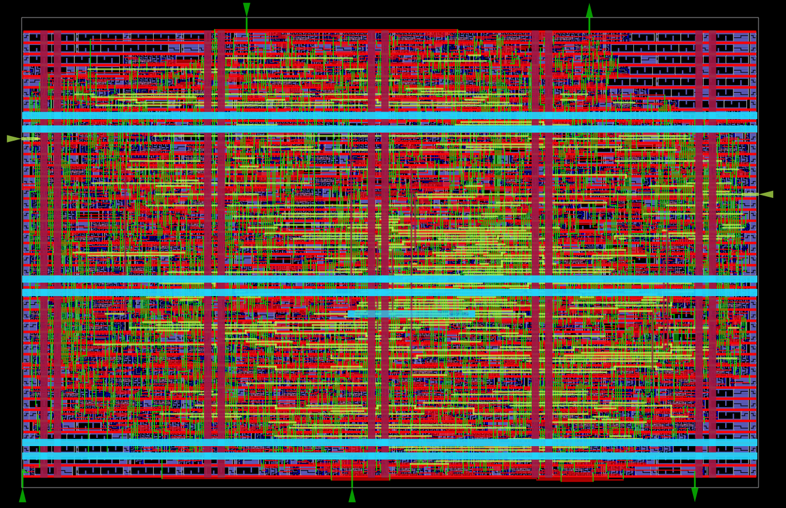

# cordic130 — 16-Bit Fixed-Point CORDIC on Sky130

A high-precision, low-latency circular CORDIC (Coordinate Rotation Digital Computer) hardware accelerator for the **SkyWater Sky130 (130 nm)** open-source PDK, hardened with the **OpenLane 1.x** automated ASIC flow.

The coprocessor accepts a 16-bit target rotation angle over an SPI bus and computes both Sine ($\sin\theta$) and Cosine ($\cos\theta$) in Q1.15 fixed-point format using a 15-stage iterative micro-rotation DSP engine.


*Final layout (`results/top.gds`), 180 µm × 115 µm.*

---

## Chip Architecture

```
                     Host System / MCU (e.g., RP2040)
                                    │ SPI
                                    ▼
                          ┌───────────────────┐
                          │   SPI Target      │
                          │   (Mode 0, MSB)   │
                          └─────────┬─────────┘
                                    │
                                    │ 16-bit Input Angle
                                    ▼
                          ┌───────────────────┐
                          │  CORDIC Engine    │
                          │  (15 Iterations)  │
                          │  Q1.15 Shift-Add  │
                          └─────────┬─────────┘
                                    │
                         ┌──────────┴──────────┐
                         ▼                     ▼
                  ┌────────────┐        ┌────────────┐
                  │ COS Output │        │ SIN Output │
                  │  (Q1.15)   │        │  (Q1.15)   │
                  └────────────┘        └────────────┘
```

---

## Key Features

* **Iterative Hardware CORDIC**: 15-stage shift-and-add circular rotation algorithm computing fixed-point Sine and Cosine.
* **Fixed-Point Precision**: Q1.15 arithmetic (1 sign bit, 15 fractional bits) over the $[-180^\circ, +180^\circ]$ range.
* **Low Error Margin**: Absolute error $\le 0.002$.
* **SPI Target Interface**: Continuous 2-word streaming protocol (SPI Mode 0, CPOL=0, CPHA=0) with full-duplex MOSI/MISO.
* **Synchronous Design**: Single system clock domain (posedge) with an active-low reset.

---

## Slot & Process

| Parameter | Value |
| --- | --- |
| **Process** | SkyWater 130 nm (`sky130A`) |
| **Standard Cell Library** | `sky130_fd_sc_hd` (High Density, 1.8 V) |
| **Tapeout Target** | SiliCluster v3 |
| **Die Area** | 180 µm × 115 µm |
| **Target Clock Frequency** | 10 MHz ($T = 100\ \text{ns}$) |
| **SPI SCK Maximum Rate** | Up to $f_{\text{CLK}} / 40$ (250 kHz SCK at 10 MHz system clock) |
| **Synthesis & PnR Flow** | OpenLane 1.0.2 (Docker) |
| **Verification Tooling** | Icarus Verilog + Cocotb v2.x |

---

## Signal Description

| Signal Name | Pin Direction | Type | Function |
| --- | --- | --- | --- |
| `i_clk` | Input | Digital Wire | Master System Clock (10 MHz nominal) |
| `i_rst_n` | Input | Digital Wire | Active-Low System Reset |
| `i_ss_n` | Input | Digital Wire | SPI Slave Select (Active-Low) |
| `i_sck` | Input | Digital Wire | SPI Serial Clock Input |
| `i_mosi` | Input | Digital Wire | SPI Master-Out Slave-In |
| `o_miso` | Output | Digital Wire | SPI Master-In Slave-Out |
| `o_cordic_done` | Output | Digital Wire | Single-cycle pulse emitted when the CORDIC output is valid |

---

## SPI Protocol Specification

The coprocessor uses a continuous **2-word (32-bit total) transaction frame** over SPI Mode 0.

### Frame Layout

```
i_ss_n : \____________________________________________________________________/
         |               Word 0               |               Word 1         |
MOSI   : [ Target Input Angle (Signed 16-bit) ] [  Dummy Data (16-bit 0x0000)   ]
MISO   : [ COS Output (From PREVIOUS Frame)   ] [ SIN Output (CURRENT Angle)   ]
```

### Data Encoding

* **Angle Input**: Signed 16-bit integer mapping $[-32768, +32767] \rightarrow [-180^\circ, +180^\circ]$.
* **Sin/Cos Outputs**: Signed Q1.15 fixed-point mapping $[-32768, +32767] \rightarrow [-1.0, +0.999969]$.

---

## ASIC Results (OpenLane 1.0.2, sky130A)

| Metric | Value |
| --- | --- |
| Die area | 180 µm × 115 µm (0.0207 mm²) |
| Core area | 19,468.7 µm² |
| Placement target density | 0.75 |
| Synthesized cells | 1,166 |
| Total cells (incl. tap / decap / fill) | 2,733 |
| Antenna diode cells | 1 |
| Clock | 10 MHz (100 ns period) |
| Critical path delay | 2.08 ns |
| Setup / hold | No violations (WNS = TNS = 0.0) |
| Total wirelength / vias | 34,501 µm / 10,157 |
| Routing DRC (TritonRoute) | 0 violations |
| Magic DRC | 0 violations |
| LVS | 0 errors |
| Antenna (pins / nets) | 0 / 0 |

### Output Files

The hardened outputs of this run are in [`results/`](results/):

| File | Description |
| --- | --- |
| `top.gds` | Final layout (GDSII) |
| `top.lef` | Abstract LEF |
| `top_gl.v` | Gate-level netlist |
| `top.sdc` | Final timing constraints |
| `metrics.csv` | Flow metrics for the run |
| `signoff/` | DRC, LVS, antenna, STA (multi-corner RC) and IR-drop reports |
| `OPENLANE_COMMIT`, `PDK_SOURCES` | Exact OpenLane commit and PDK sources used |

### Reproducing the Run

With OpenLane 1.0.2 and the `sky130A` PDK installed (inside the OpenLane Docker container):

```bash
mkdir -p designs/cordic
cp -r src openlane/config.json openlane/cordic_spi.sdc designs/cordic/
./flow.tcl -design cordic -tag run2 -overwrite
```

---

## Verification

The Design Under Test (DUT) is verified with a **Cocotb v2.x** Python test suite across 5 test modules.

### Prerequisites

```bash
sudo apt install -y iverilog
python3 -m venv .venv && source .venv/bin/activate
pip install -r sim/cocotb/requirements.txt
```

## License

This project is licensed under the **Apache License 2.0** — see the [LICENSE](LICENSE) file for details.

Built with the [SkyWater Sky130 PDK](https://github.com/google/skywater-pdk), [OpenLane](https://github.com/The-OpenROAD-Project/OpenLane), [Icarus Verilog](https://github.com/steveicarus/iverilog) and [cocotb](https://github.com/cocotb/cocotb).
